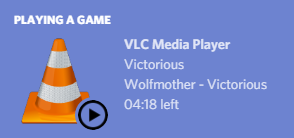

# vlc-discord-rpc
Discord rich presence for VLC media player.

## Requirements
- [Node.JS and NPM](https://nodejs.org/en/) (unless you're using a bundle release)
- [VLC](https://www.videolan.org/index.html)
- [Discord desktop client](https://discordapp.com/)

## Setup
 1. [Download the latest release for your platform](https://github.com/Pasi-dev-xyz/VLC-Discord-RPC)
  - If you download a bundle release, you will not need to install Node.JS/NPM
 2. Unzip the file
 3. Launch the start file
 4. Play media in the VLC window that opens

If you installed VLC to a strange place, or you get the error "A problem occurred while launching vlc", you will need to edit the path of VLC in [config/config.js](./config/config.js).

### Configuration
[config/config.js](./config/config.js) may need to be modified if:
 - Your system uses an abnormal VLC install
 - You have manually configured your VLC web interface

Please see [CONFIGURATION.md](./CONFIGURATION.md) to learn more about manual configuration.

### Limitations
 - When running multiple concurrent instances, only the first-opened instance of VLC will have a rich presence
 - The rich presence cannot display album art
